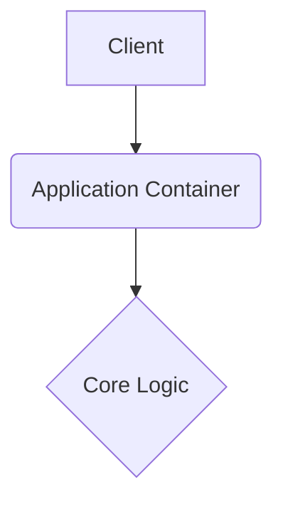

# pooltech

This repository is built with strict enterprise engineering standards, focusing on resilient architecture, graceful error handling, and robust continuous integration.

## 🏗️ System Architecture



## 🚀 Setup Instructions

```bash
docker-compose up --build -d
```

## 📂 Structure

Following standard design patterns for a predictable layout.

---

## Original Readme

# pooltech

This repository is built with strict enterprise engineering standards, focusing on resilient architecture, graceful error handling, and robust continuous integration.

## 🏗️ System Architecture


## 🚀 Setup Instructions

```bash
docker-compose up --build -d
```

## 📂 Structure

Following standard design patterns for a predictable layout.

---

## Original Readme

# 🏊 PoolTech - Official Website
### Professional Swimming Pool Construction & Maintenance Services

## 🌟 About
**PoolTech** is a leading swimming pool contractor dedicated to transforming backyards into personal paradises. We specialize in providing comprehensive pool solutions including custom installation, renovation, repair, and maintenance for residential and commercial properties.

## 🚀 Features
*   **Responsive Design**: Mobile-first approach ensuring a seamless experience across all devices.
*   **Modern UI/UX**: Built with React and Tailwind CSS for a sleek, fast, and interactive user interface.
*   **Service Showcase**: Detailed sections for pool installation, repair, renovation, and inspection.
*   **Interactive Quote Form**: Easy-to-use request form for potential clients to get estimates.
*   **Testimonials Section**: Highlighting customer satisfaction and project success stories.
*   **SEO Optimized**: structured data and semantic HTML for better search engine visibility.

## 🛠️ Technologies Used
*   **Frontend**: React 18, TypeScript, Vite
*   **Styling**: Tailwind CSS, Shadcn UI
*   **Icons**: Lucide React
*   **Animation**: CSS Animations, Transistions
*   **Deployment**: Ready for Netlify/Vercel/GitHub Pages

## 📁 Project Structure
```
pooltech/
├── public/             # Static assets
├── src/
│   ├── assets/         # Images and media
│   ├── components/     # Reusable UI components
│   │   ├── ui/         # Shadcn UI primitives
│   │   ├── Header.tsx  # Navigation
│   │   ├── Footer.tsx  # Footer & Contact
│   │   └── ...
│   ├── pages/          # Main application pages
│   │   └── Index.tsx   # Landing page
│   ├── lib/            # Utility functions
│   ├── App.tsx         # Root component
│   └── main.tsx        # Entry point
├── index.html          # HTML entry
├── package.json        # Dependencies
└── README.md           # Project documentation
```

## 🎯 Key Sections
*   **Hero Section**: Captivating imagery with clear calls-to-action.
*   **Services**: Detailed breakdown of Installation, Repair, Renovation, and Inspection.
*   **Process**: Step-by-step guide on how we work (Consultation -> Plan -> Install -> Inspect).
*   **Testimonials**: Real reviews from satisfied homeowners.
*   **Contact**: Integrated quote request form and direct contact information.

## 🚀 Getting Started

### Local Development
1.  **Clone the repository**
    ```bash
    git clone https://github.com/prajwal918/pooltech.git
    cd pooltech
    ```

2.  **Install dependencies**
    ```bash
    npm install
    ```

3.  **Start the development server**
    ```bash
    npm run dev
    ```
    The site will be available at `http://localhost:8080`.

### Build for Production
```bash
npm run build
```

## 📱 Responsive Design
*   **Desktop**: Full-width layouts with immersive visuals.
*   **Tablet**: Adaptive grids and readable typography.
*   **Mobile**: Touch-optimized navigation and form elements.

## 📞 Contact Information
*   **Phone**: (555) 123-4567
*   **Email**: info@pooltech.com
*   **Address**: 123 Pool Lane, Suite 100
*   **Hours**: Mon - Fri: 7AM - 7PM

## 📄 License
This project is proprietary to **PoolTech**. All rights reserved.

---
Built with ❤️ by the **PoolTech Development Team**
