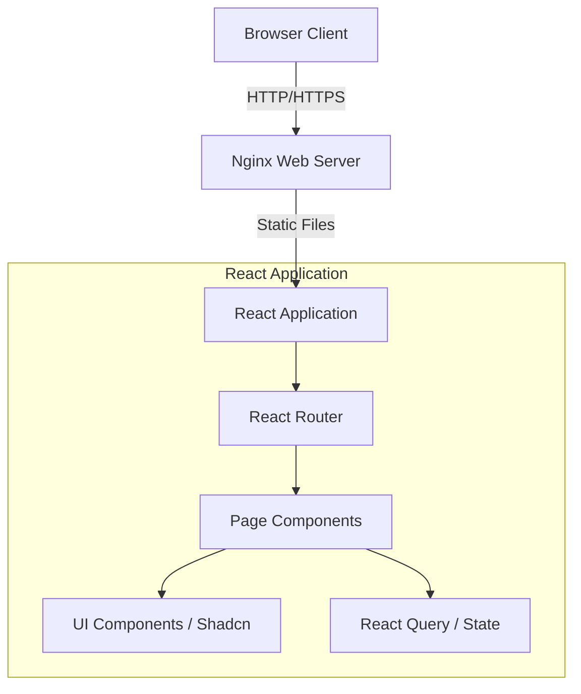

# Pooltech

A modern React application built with Vite, TypeScript, and Tailwind CSS.

## Architecture



## Setup Instructions

### Prerequisites
- Docker and Docker Compose installed on your system.

### Running the Application

1. Clone the repository.
2. Build and start the container using Docker Compose:
   ```bash
   docker-compose up -d --build
   ```
3. Access the application at `http://localhost:8080`.

To stop the application:
```bash
docker-compose down
```

## Dependency Rationale

- **Vite**: Chosen for its fast HMR and optimized build process compared to traditional bundlers.
- **React**: The core UI library, providing a component-based architecture.
- **TypeScript**: Adds static typing, improving code quality and developer experience.
- **Tailwind CSS**: Utility-first CSS framework for rapid and consistent styling.
- **Shadcn UI**: Provides accessible, customizable components built on Radix UI and Tailwind.
- **React Query**: Efficient data fetching, caching, and state management.
- **React Router**: Standard routing solution for React single-page applications.

## Development

To run the application locally without Docker:
```bash
npm install
npm run dev
```
